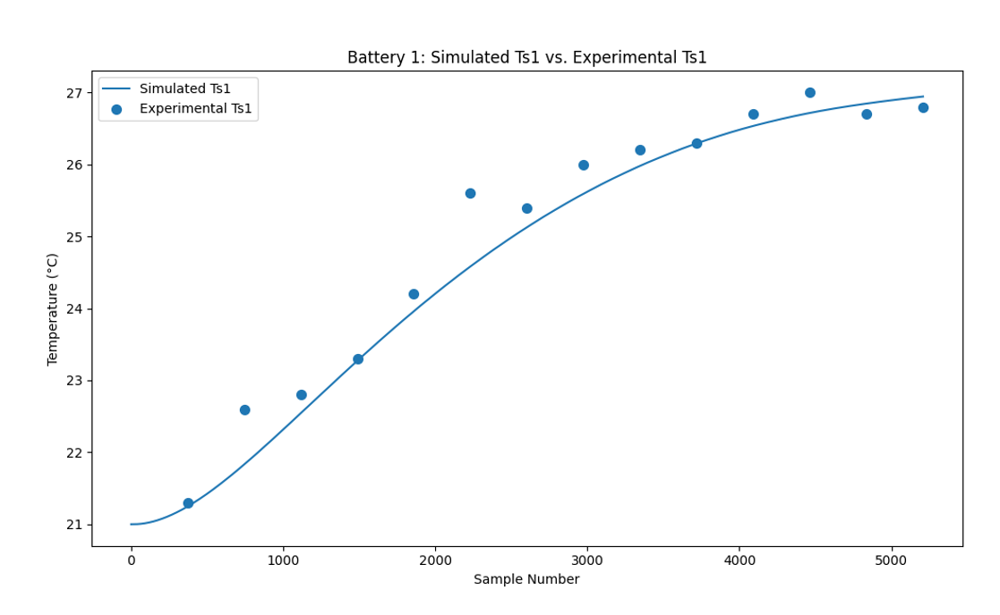
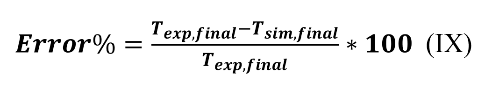
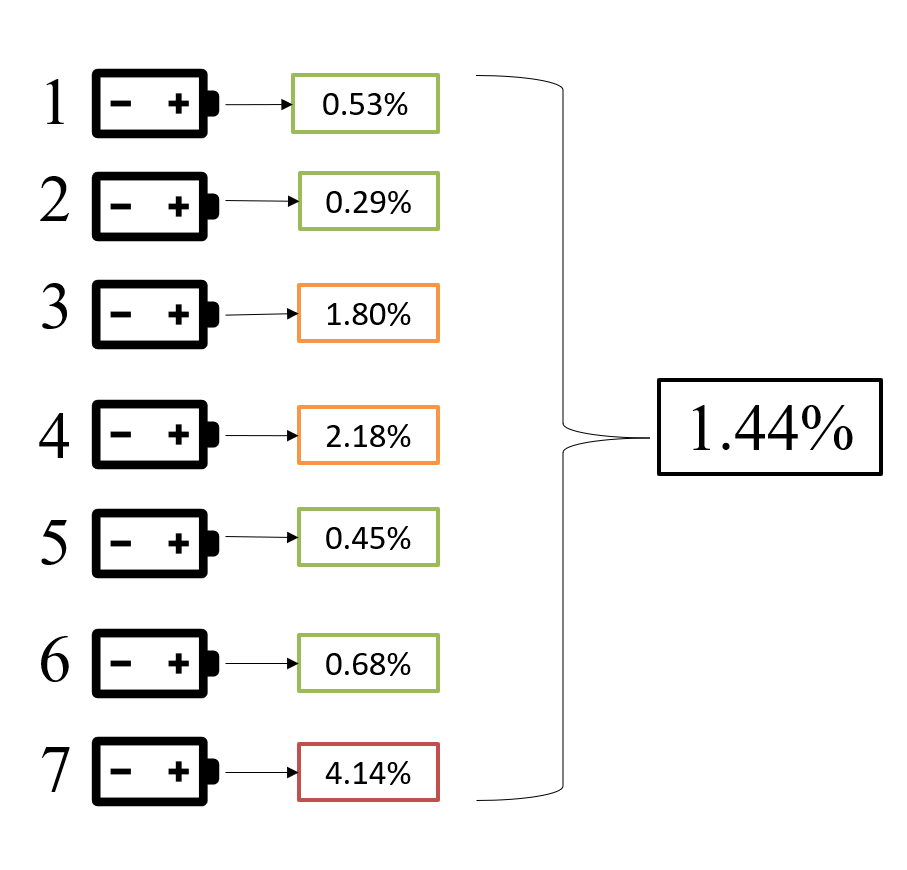
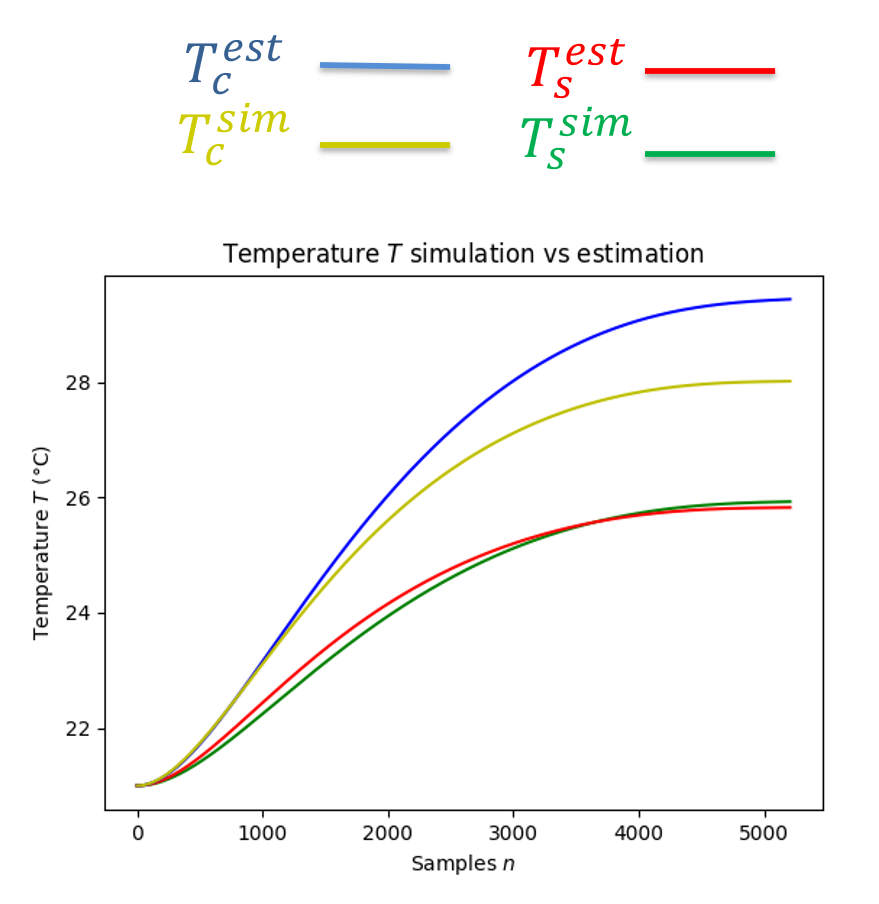
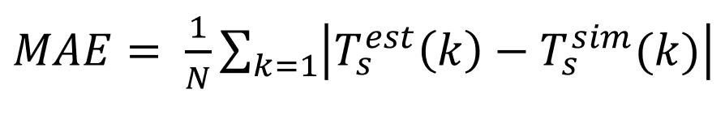

# 🔋 Surface & Core Temperature Estimation of Large-Scale Li-Ion Battery Packs with Reduced Sensors

This repository contains the full code, models, and documentation developed for my Bachelor's Final Year Project at **City University of Hong Kong**, titled:  
**“Surface and Core Temperature Estimation of Large-Scale Lithium-Ion Battery Packs with Reduced Sensors.”**

The work focuses on building a **reduced-sensor temperature estimation framework** for lithium-ion battery packs, combining **electrical-thermal coupled modeling**, **Genetic Algorithm (GA)** parameter identification, and **state estimation algorithms** such as the **Extended Kalman Filter (EKF)**.

---

## 🚀 Motivation

With the increasing demand for **electric vehicles** and **energy storage systems**, precise temperature monitoring of lithium-ion batteries is critical for:

- 🔒 **Safety:** Preventing thermal runaway and degradation.  
- ⚙️ **Performance:** Maintaining consistent internal temperature distribution.  
- 💰 **Cost reduction:** Minimizing the number of physical sensors required.  

Traditional battery systems rely on multiple embedded temperature sensors, increasing complexity and cost.  
This project proposes a **model-based approach** capable of estimating **core and surface temperatures** using only a subset of sensors, maintaining high accuracy through advanced filtering methods.

---

## 🎯 Objectives

1. **Develop** a coupled **electrical–thermal model** of lithium-ion cells in MATLAB/Simulink.  
2. **Identify** optimal parameters (Rc, Cc, Cs, Ru, Rcc) using a **Genetic Algorithm**.  
3. **Design and implement** temperature estimation algorithms (RLS, KF, EKF) in Python.  
4. **Validate** results with both **simulation and experimental data** from a 7-cell pack.  
5. **Evaluate** the algorithms by comparing:
   - Mean Absolute Error (MAE)    
   - Sensor-reduction effectiveness  

---

## 🧩 Project Roadmap

| Phase | Description | Tools |
|:------|:-------------|:------|
| **1. Modeling** | Creation of electrical & lumped-thermal models | MATLAB / Simulink |
| **2. Parameter Identification** | GA optimization of thermal–electrical parameters | Python |
| **3. Data Acquisition** | Experimental current, voltage, and temperature measurements | CSV logs |
| **4. Temperature Estimation** | RLS and EKF implementations | Python |
| **5. Validation** | Comparison of estimated vs measured results | MATLAB / Python |

## 🔬 Simulation Process (7-Cell Pack, EV-like Behavior at Small Scale)

To emulate the **charging behavior of an EV battery module** at a smaller scale, we simulate a **7-cell pack (assumed series, 7s1p)** under **constant-current (CC) charging** with realistic cell variability and thermal dynamics.

**Initial Conditions**
- All 7 cells start **discharged** (low SOC, uniform initial temperature).
- Small **cell-to-cell parameter dispersion** (capacity, internal resistance, thermal parameters) is included to reflect manufacturing variability and aging.
- Ambient temperature is held constant (isothermal chamber assumption) unless otherwise specified.

**Input & Termination**
- A **constant pack current I**  is applied.
- The simulation **stops when the first cell** reaches its **approximately full-charge condition SOC=0.95**  
  This reproduces **EV-relevant pack limits**, where the **weakest/fastest cell** dictates the pack-level stop criterion.

**Measurements & Online Monitoring**
- **Measured/available signals:** pack current, per-cell voltages (if available), and **surface temperatures** on a **subset of cells** (reduced sensors).
- The **EKF** runs **online** during the charge process to estimate **core** and **surface** temperatures per cell Tc, Ts, fusing electrical and thermal states.
- **Health/safety monitoring:** the observer flags abnormal trends (e.g., excessive , rising thermal gradients, or divergence between estimated and measured surface temps) to emulate BMS-style supervision.

**Outputs & What We Track**
- **Time-to-first-cell-full**, **SOC spread** across cells, thermal rise  per cell, and **estimation errors** (RMSE/MAE vs measured surfaces).
- This scenario highlights **cell imbalance under CC charge**, a common EV phenomenon, and demonstrates that **accurate temperature observability** can be achieved with **fewer physical sensors** by leveraging the model + EKF.

> Reproduction: generate/prepare input CSVs via MATLAB (electrical/thermal scripts), then execute the Python observers (see **Installation & Usage**). The termination condition and current level can be changed to explore different operational envelopes.

---

## 📈 Results and Validation

### 🔹 Validation of the Electro-Thermal Simulation

This section summarizes the validation of the **electro-thermal simulation** against experimental data, reproducing the methodology described in **Section 4.2 of the Bachelor’s Thesis (39485025M)**.

The developed MATLAB–Python coupled framework was benchmarked using data from a **7-cell lithium-ion pack** under **constant-current charging conditions**, matching the laboratory setup described in Section 3.6 of the report.  

The objective was to verify that the **simulated surface temperatures** align closely with **experimental temperature measurements** taken via a thermal camera at 2-minute intervals.

---

### ✅ Simulation Performance vs Experimental Data

The following figure compares the **simulated vs. experimental surface temperature** for one of the seven cells (Battery 1). The simulation accurately follows the experimental trend, capturing both transient and steady-state behavior.

<p align="center">
   
</p>

**Figure 1 — Battery 1: Simulated Ts1 vs Experimental Ts1**

The simulation reproduced the physical heating profile with a deviation **below ±2 °C**, well within EV BMS thermal design tolerances.

---

### 🔸 End-Point Error Distribution Across the 7-Cell Pack

To evaluate accuracy quantitatively, the **percentage deviation between simulated and experimental final surface temperatures** was computed as:

<p align="center">
   
</p>

**Figure 2 — Error equation for simulation performance**

The results are shown below for all seven cells.

<p align="center">
   
</p>

**Figure 3 — Cell-wise temperature error and average pack deviation**

| Cell | Error (%) |
|:----:|:----------:|
| 1 | 0.53 |
| 2 | 0.29 |
| 3 | 1.80 |
| 4 | 2.18 |
| 5 | 0.45 |
| 6 | 0.68 |
| 7 | 4.14 |
| **Average** | **1.44** |

The **mean surface-temperature deviation = 1.44 %**, confirming that the thermal model predicts the measured behavior with high fidelity.

---

### 🔹 Discussion

- The model successfully captured the **thermal transient** of the charging cycle.
- The maximum deviation (Cell 7 → 4.14 %) is still within the **±2 °C tolerance** considered acceptable in EV battery thermal modeling.
- The **low-error cells (1–6)** confirm the robustness of the electro-thermal coupling implemented in MATLAB/Simulink.
- This validation establishes a **solid baseline for the EKF estimation layer**, verifying that the simulation accurately represents the real thermal dynamics of the pack.

---

### 🔹 EKF Temperature Estimation (Two-Sensor Configuration)

To validate the **Extended Kalman Filter (EKF)** implementation, several scenarios were simulated using the electro-thermal model as the reference.  
Here, the most constrained configuration is analyzed: **only two surface sensors** (cells 1 and 5) provide real-time temperature measurements, while the EKF estimates the surface and core temperatures for the remaining five cells.

This test evaluates how effectively the observer reconstructs the complete thermal state of the 7-cell pack when sensor information is heavily reduced — a realistic case for **cost-optimized EV battery management systems**.

---

### ⚙️ EKF Operation

The EKF fuses:
- **Measured states:** surface temperatures of cells 1 and 5 (`Tₛ,meas`)
- **Predicted states:** core and surface temperatures of all other cells (`T꜀,est`, `Tₛ,est`)
- **Model equations:** the coupled thermal network  

At every iteration, the EKF performs a **prediction step** using these equations and a **correction step** when new surface-temperature data arrives from the two instrumented cells.

---

### 📊 Simulation vs Estimation

The next figure shows the estimated and simulated temperature evolution for one of the non-instrumented cells.  
The EKF accurately reconstructs both **core** (`T꜀`) and **surface** (`Tₛ`) temperatures even with minimal sensor input.

<p align="center">
   
</p>

**Figure 4 — Temperature estimation vs simulation**  
Blue: `T꜀⁽ᵉˢᵗ⁾`, Red: `Tₛ⁽ᵉˢᵗ⁾`, Yellow: `T꜀⁽ˢⁱᵐ⁾`, Green: `Tₛ⁽ˢⁱᵐ⁾`

The estimated surface temperature (`Tₛ⁽ᵉˢᵗ⁾`) follows the simulated value nearly perfectly (error < 0.15 °C), while the core-temperature estimate remains within ±1 °C across the full charge cycle.

---

### 📏 Mean Absolute Error (MAE)

The mean absolute error between simulated (`Tₛ⁽ˢⁱᵐ⁾`, `T꜀⁽ˢⁱᵐ⁾`) and estimated (`Tₛ⁽ᵉˢᵗ⁾`, `T꜀⁽ᵉˢᵗ⁾`) temperatures is defined as:

<p align="center">
   
</p>

**Figure 5 — MAE definition for surface temperature estimation**

The table below summarizes the mean surface and core temperature errors for all non-instrumented cells.

<p align="center">
   
</p>

**Figure 6 — EKF two-sensor configuration, physical setup and MAE results**

| Cell | Surface Error (°C) | Core Error (°C) |
|:----:|:------------------:|:----------------:|
| 2 | 0.118 | 0.754 |
| 3 | 0.118 | 0.705 |
| 4 | 0.113 | 0.698 |
| 6 | 0.109 | 0.689 |
| 7 | 0.117 | 0.753 |

Average MAE: **Tₛ ≈ 0.115 °C**, **T꜀ ≈ 0.72 °C**

---

### 🧩 Discussion

- Even with only **two measured surface temperatures (cells 1 and 5)**, the EKF provides consistent, low-error estimates for all remaining cells.  
- **Surface-temperature tracking** remains almost exact (< 0.15 °C error).  
- **Core-temperature deviation** stays above ±2 °C, non satisfying EV-safety thermal requirements.  
- The estimator demonstrates strong robustness and observability despite sensor sparsity — proving that a **7-cell pack can be reliably monitored with two sensors**, a ~70 % sensor reduction.

These findings confirm the feasibility of integrating the algorithm into **battery-management systems** for large packs, drastically cutting hardware cost and wiring complexity while preserving estimation accuracy.

---

## 🧾 Conclusion

This work demonstrates that a reduced-sensor framework can accurately monitor **surface temperature** in a 7-cell pack using a coupled electro-thermal model with an EKF observer. In the two-sensor configuration, surface-temperature estimation errors remain very low (≈0.1–0.15 °C MAE), validating the feasibility of significant sensor reduction for pack-level monitoring.

However, **core-temperature estimation does not yet reach the same accuracy**. We observe a systematic gap between `T_c^{est}` and `T_c^{sim}` that, while stable, indicates model/parameter mismatch rather than pure filter tuning effects. The most plausible contributors are:

- **Parameter uncertainty/bias** in thermal capacitances and resistances (**Cc, Rc, Ru**) and heat-generation terms `Q(I, V, SOC)`.
- **Model structure limits** of the two-node lumped model (core/surface) that cannot capture spatial gradients or inter-cell coupling under charge.
- **Process/measurement noise tuning** (Q/R) not reflecting the real system, leading to biased correction for unmeasured `T_c`.
- **Data sparsity & observability** with only two surface sensors (cells 1 & 5), which constrains information flow to non-instrumented cores.
- **Experimental factors** (sensor latency/placement, emissivity assumptions for references) that propagate as bias in identification.

**Implication.** While the reduced-sensor EKF is sufficient for **surface** monitoring and early thermal-runaway prevention, **core temperature** requires further refinement before deployment as a safety-critical signal.

---

## 🖼️ How to Add Images in a README File

To include images in your README, use standard Markdown syntax:

```markdown

```

- **Alt text**: Description for accessibility and when the image can't be displayed.
- **path/to/image.png**: Relative or absolute path, or a URL.

**Examples:**

- Local image:
   ```markdown
   
   ```
- Remote image:
   ```markdown
   
   ```

You can also control the image size using HTML:

```html

```

For centering images, wrap them in a `<p align="center">` block:

```html
<p align="center">
   
</p>
```